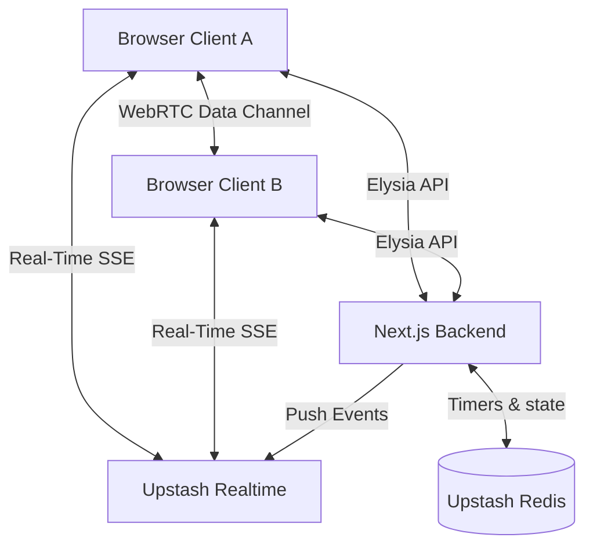

<div align="center">
  <h1>🔒 Cypher Chat </h1>
  <p><strong>A real-time, zero-trace, peer-to-peer chat application built for absolute privacy.</strong></p>
  <i>Conversations that leave no metadata, no server logs, and absolutely no trace.</i>
  
  <br />
  <br />

  
  
  
  
  
  

</div>

---

## ✨ Why Cypher Chat?

Cypher Chat combines ephemeral messaging with modern peer-to-peer technologies for a secure communicating experience.

- ⏳ **Self-Destructing Rooms** — Every room has a strict 10-minute timer. When time runs out, the room and all messages are permanently erased from the server.
- 🖼️ **Hidden Payload Messages** — Hide secret text or an image behind a normal preview image. The payload is encrypted and decoupled, revealing only when the recipient explicitly unlocks it.
- 📁 **P2P File Transfer** — Share files directly user-to-user over WebRTC. Files never touch a central server, ensuring absolute privacy.
- 🔐 **End-to-End Encryption** — Messages and payloads are secured client-side using AES-GCM before ever leaving the browser.
- 💨 **Cinematic Disintegration** — Messages individually visually disperse into digital dust when they expire. 
- ☢️ **Instant "Nuke" & Panic** — Destroy the entire room instantly with the click of a button, triggering a cinematic green pixel disintegration, or simply press `Esc` to immediately panic-close and wipe the room from existence.
- 🕵️ **Anonymous & Accountless** — No accounts required. You are assigned a random codename, and access is controlled via temporary `httpOnly` tokens.
- ⚡ **Lightning Fast** — Built with Upstash Realtime Server-Sent Events (SSE) and Elysia.js for blazing fast delivery.

---

## 🏗️ How It Works

Cypher Chat's architecture is built to guarantee privacy by design.

1. **The Sandbox:** You create a room with a security question. Clients derive a room key locally (PBKDF2), while the server stores only room/session metadata with TTL.
2. **The Connection:** Your partner joins. Messages are instantly streamed via Upstash **Server-Sent Events (SSE)**.
3. **The Data Path:** 
   - **Encrypted Text:** AES-GCM-encrypted on-device and relayed via Upstash streams/realtime.
   - **Hidden Payload Messages:** The preview image + hidden payload packet are assembled client-side and sent as encrypted chat messages.
   - **P2P Files:** Sent directly over WebRTC data channels negotiated via the secure room signaling.
4. **The Cleanup:** When the timer hits zero (or "Destroy" is pressed via UI or `Esc`), everything drops. No traces are kept.

<details>
<summary><b>View Architecture Diagram</b></summary>



</details>

---

## 🚀 Getting Started

Want to run your own zero-trace server?

### Prerequisites

- [Bun](https://bun.sh/) (v1.0+)
- An [Upstash](https://upstash.com/) account (for Redis and Realtime)

### Installation

1. **Clone the repository**
   ```bash
   git clone https://github.com/ArAnirudh2901/Redacted-Chat.git
   cd Redacted-Chat
   ```

2. **Install dependencies**
   ```bash
   bun install
   ```

3. **Configure Environment Variables**
   ```bash
   cp .env.example .env.local
   ```
   Add your Upstash Redis credentials to `.env.local`.

4. **Launch the app**
   ```bash
   bun dev
   ```
   Visit [http://localhost:3000](http://localhost:3000) 

---

## 💻 The Technology Behind Cypher Chat

- **Core:** Next.js (App Router), React, Tailwind CSS 4, Framer Motion
- **Backend / APIs:** Elysia.js, Eden Treaty SDK, Zod (Validation)
- **Real-Time Data:** Upstash Realtime (SSE)
- **Database / State:** Upstash Redis (TTL Caching)
- **P2P & Crypto:** WebRTC (`simple-peer`), Native Web Crypto API (AES-GCM)
- **Effects:** HTML2Canvas, custom particle disintegration engines

---

## 🔐 Hidden Payload Architecture

Cypher Chat uses a "lossless" approach to hide secret payloads rather than traditional fragile steganography:

- **Gatekeeper Derived Key:** The room key is derived client-side via PBKDF2 from a shared security question and never sent to the server.
- **Payload Contract:** Each hidden message creates a composite packet containing a visible "cover" image and an encrypted payload containing secret text, an image, or both.
- **Reveal UX:** Hidden content is completely decoupled from the cover image pixels. It extracts and displays flawlessly 100% of the time only when the user chooses to "Reveal" it locally.
- **Size Safety:** Images are efficiently compressed client-side before transmission, ensuring blazing fast realtime delivery.

---

## 📝 License

This project is open source and available under the [MIT License](LICENSE).
